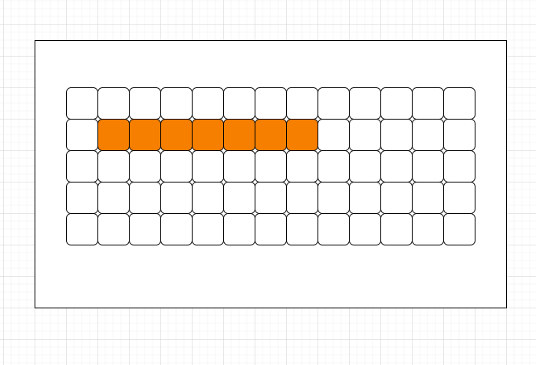
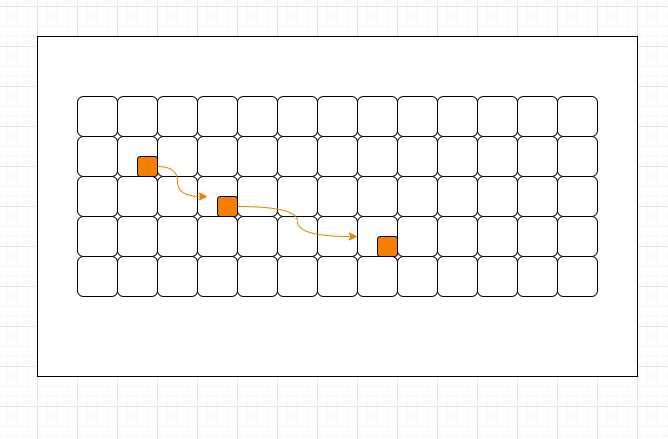

# 算法基本概念
记录下算法与数据结构常用的名词概念及解释。

评估算法优劣的三大指标，重要性以此降低：
- 时间复杂度
- 额外空间
- 常数操作

## 时间复杂度
简单理解为完成某个题解的步骤数。
比如在数组中获取某个下标的元素，只需要从0开始，到offset位置即可。在一个数组中不管这个下标在哪儿，都只需要一步。

**只关心最高阶的数据计算步骤。**
## 空间复杂度

## 数据在内存中的分布结构
即：物理结构。
有两种。
- 数组
- 链表

### 数组
在内存中占用的内存空间是连续的。

### 链表
链表中的元素并不是连续的，每个元素内部维护指针指向其他元素。比如单向链表和双向链表。

双向链表省略。
